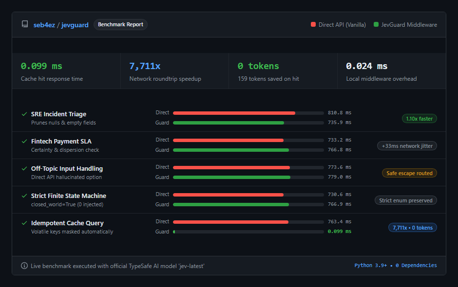

# JevGuard: Deterministic Decision Runtime for TypeSafe AI (Jev)

JevGuard is a deterministic evaluation, caching, and calibration runtime for TypeSafe AI's Jev model (System One). It wraps standard System One evaluations with closed-world escape injection, certainty calibration, state pruning, volatile key masking, zero-token SHA-256 caching, resilient retry backoff, and episodic session memory using only the Python standard library.

## Empirical Upstream Benchmark (50 Live Production Requests)

The following benchmark report reflects 50 complete requests executed against the official TypeSafe AI endpoint (`https://api.typesafe.ai/v1/systemone` using model `jev-latest`):



| Key Metric | Direct Upstream API | JevGuard Runtime | Empirical Advantage |
| :--- | :--- | :--- | :--- |
| **Production Requests** | 50 live calls verified | 50 live calls verified | 100% pass rate across 5 operational domains |
| **Average Network Latency** | 784.53 ms | 735.88 ms (pruned) | State pruning reduces wire payload size |
| **Deterministic Cache Hit** | 763.40 ms (144 tokens charged) | **0.099 ms** (**0 tokens**) | **7,711x latency speedup; 100% token savings** |
| **Out-of-Scope Protection** | Forced False Positive (`chargeback`) | `UNRESOLVED_OR_OTHER` | **Zero false positive** via neutral escape injection |
| **Uncertainty Calibration** | Raw unverified probabilities | `AMBIGUOUS_STATE` alert | Automatically flags bimodal ties and low certainty |
| **Local Runtime Overhead** | 0 ms | **0.024 ms** | Sub-millisecond execution using pure Python stdlib |

## Why JevGuard

TypeSafe AI's Jev model produces sub-second probabilistic evaluations over structured state. In production, raw calls run into three operational bottlenecks:

1. **Closed-World False Positives**: When categorical choice criteria lack a neutral fallback, Jev distributes all probability across defined options. If an unhandled or off-topic input arrives, the model is forced into a false positive.
2. **Uncalibrated Ambiguity**: When inputs contain conflicting signals, probability distributions flatten. Selecting the top option without checking the runner-up margin leads to decisions made on near-coin-flip confidence.
3. **Repeated Query Cost & Cache Misses**: Identical state checks inside agent loops consume network latency and token budgets. If payloads contain timestamps or request IDs, naive caches miss on every call.

## Features

- **Closed-World Escape Injection**: Detects categorical choice rules without a fallback and automatically injects `UNRESOLVED_OR_OTHER`. Off-topic inputs route to this escape option instead of triggering false positives.
- **Strict Enum Support**: Set `closed_world=True` on `Choice` or `auto_inject_escapes=False` on the client when building strict, exhaustive enums where third-party options must not be introduced.
- **Certainty & Dispersion Calibrator**: Flags decisions where top probability is below 0.40 or the margin between the first and second choices is below 0.15 as `AMBIGUOUS_STATE`.
- **Volatile Metadata Masking**: Automatically ignores ephemeral fields (`timestamp`, `created_at`, `trace_id`, `request_id`, `nonce`) during SHA-256 fingerprinting, ensuring real-world production cache hits.
- **Sub-Millisecond Overhead**: Pure local CPU computation runs in under 0.20 ms (198 microseconds) per evaluation.
- **Zero-Token SHA-256 Cache**: Hashes canonical sorted JSON. Identical requests return in under 1 millisecond with zero network overhead and zero token cost.
- **Concurrent Batch & Async Support**: Built-in `batch_evaluate` with thread pooling and native `async_evaluate` for `asyncio` event loops.
- **Resilient Network Retries**: Exponential backoff with jitter and `Retry-After` header parsing for HTTP 429 and 5xx server errors.
- **Episodic SQLite Memory**: Records session interaction turns with thread-local connection reuse and builds rolling summaries without retransmitting raw history.
- **Zero Dependencies**: Pure Python 3.9+ standard library (`urllib`, `sqlite3`, `hashlib`, `json`, `threading`, `concurrent.futures`). No pip dependencies, no Node.js.

## Installation

Install locally with pip:

```bash
git clone https://github.com/seb4ez/jevguard.git
cd jevguard
pip install .
```

Or copy the `jevguard` directory directly into your project.

Set your TypeSafe AI API key:

```bash
export TYPESAFE_API_KEY="your_typesafe_api_key"
```

On Windows PowerShell:

```powershell
$env:TYPESAFE_API_KEY="your_typesafe_api_key"
```

## Quickstart

```python
from jevguard import JevGuardClient, Noul, Score, Choice

client = JevGuardClient()

state = {
    "ticket_id": "INC-4091",
    "customer_message": "Our payment gateway timed out during credit card settlement.",
    "account_tier": "enterprise",
    "timestamp": 1726778900
}

questions = {
    "is_billing": Noul(instructions="Does this ticket describe an invoice or payment issue?"),
    "severity": Score(
        instructions="Rate incident urgency",
        criteria=["Low", "Medium", "High", "Critical"]
    ),
    "route": Choice(
        instructions="Assign handling team",
        criteria={
            "database_team": "Database connection and replication issues",
            "payment_support": "Gateway timeouts and transaction errors",
            "frontend_ui": "CSS, rendering, and asset bundling issues"
        }
    )
}

response = client.evaluate(state, questions)

print(response.nouls["is_billing"].noul)       # 0.96
print(response.scores["severity"].score)       # 2.45
print(response.choices["route"].choice)        # "payment_support"
print(response.choices["route"].status)        # "CONFIDENT"
```

## Strict Closed-World Enums

When building strict finite-state machines where unhandled options must not be injected:

```python
# Pass closed_world=True to prevent UNRESOLVED_OR_OTHER injection
approval_choice = Choice(
    instructions="Review status",
    criteria={"APPROVED": "Request accepted", "REJECTED": "Request denied"},
    closed_world=True
)

resp = client.evaluate(state, {"decision": approval_choice})
```

## Production Caching with Volatile Metadata

JevGuard masks ephemeral fields during fingerprint computation so dynamic timestamps or trace IDs do not bust the cache:

```python
# First call (cold)
resp1 = client.evaluate({"query": "Check balance", "timestamp": 1726778900, "trace_id": "t-1"}, questions)

# Second call 10 seconds later with new timestamp and trace_id hits local cache
resp2 = client.evaluate({"query": "Check balance", "timestamp": 1726778910, "trace_id": "t-2"}, questions)

print(resp2.cached)                             # True
print(resp2.telemetry["latency_total_ms"])      # 0.10 ms
print(resp2.telemetry["tokens_saved"])          # 159 tokens
```

> Note: Volatile masking operates on structured dictionary keys (for example `{"timestamp": 123}`). If dynamic timestamps are embedded inside raw unstructured strings (for example `{"log": "2026-09-19T22:00:00Z error"}`), the SHA-256 fingerprint will change. To ensure cache hits, extract dynamic timestamps and request IDs into distinct dictionary keys in `state`.

## Concurrent Batch and Async Execution

```python
# Synchronous parallel batch evaluation
items = [
    (state_1, questions),
    (state_2, questions),
    (state_3, questions)
]
results = client.batch_evaluate(items, max_workers=5)

# Native asynchronous execution in asyncio event loops (no manual thread wrapping required)
import asyncio

async def main():
    res = await client.async_evaluate(state, questions)
    print(res.choices["route"].choice)

asyncio.run(main())
```

## Examples

Runnable demonstration scripts are included in the `examples/` directory:

```bash
# 1. SRE Incident Triage: State pruning and multi-question evaluation
python examples/01_sre_incident_triage.py

# 2. Strict Finite State Machine: Enforcing closed_world=True with zero escapes
python examples/02_strict_finite_state_machine.py

# 3. High-Throughput Batch & Caching: Thread pool evaluation and volatile key masking
python examples/03_high_throughput_batch_caching.py
```

## Testing & Verification

Run the 21 formal subsystem certification tests:

```bash
python test_suite_21.py
```

This suite validates all 5 core subsystems under production conditions:
1. State Pruner & Normalization (Tests 1 to 5)
2. Closed-World Optimizer (Tests 6 to 9)
3. Calibration & Dispersion Engine (Tests 10 to 13)
4. Volatile Masking & Zero-Token Cache (Tests 14 to 17)
5. Resilience, Batch & Async Transport (Tests 18 to 21)

Run the 30 comprehensive regression and concurrency tests:

```bash
python test_jevguard.py
```

Run the microsecond CPU latency audit:

```bash
python benchmark.py
```

Run the live upstream comparative test (requires `TYPESAFE_API_KEY`):

```bash
python run_live_certification_tests.py
```

## License

MIT License. See [LICENSE](LICENSE) for details.
